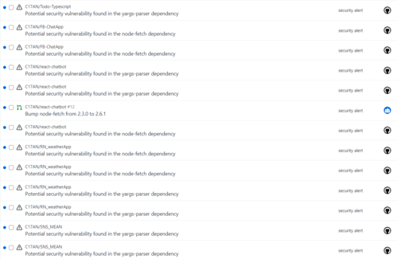
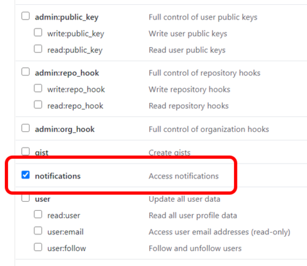

## Gittify, Chrome Extension for Github notification

Being Tired of `security alert` Notifications?
Git + Notify, Gittify will serve you handy Notifications.

### [How to Us]

### 1. Create your new Personnal Access Token. [Link](https://github.com/settings/tokens)

The only permission you need is `Notification`.  
for security reason, I recommend not to check other unneccesary permissions.

---

### 2. Login with your Token

With your SHA256 Token, You can Login to extension.  
This will be not saved on server, It only exists on your Local Storage.

---

## [Core Features]

### [Handy Check Unread Notifications]

### [Check Security Alert Notifications with One Click]

---

### How It works

Gittify scans your new Notifications every 10 minutes, and turns red when you recieve new GitHub Event.  

---

### Signing Out

Gittify saves your GH Token on your local Browser, and removes the token when you try to sign out.  

---

### WIP Image

